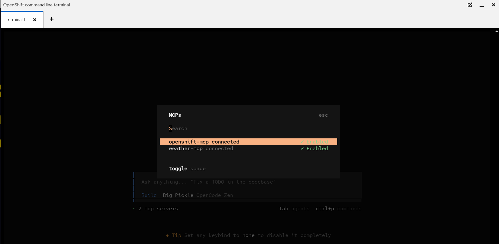
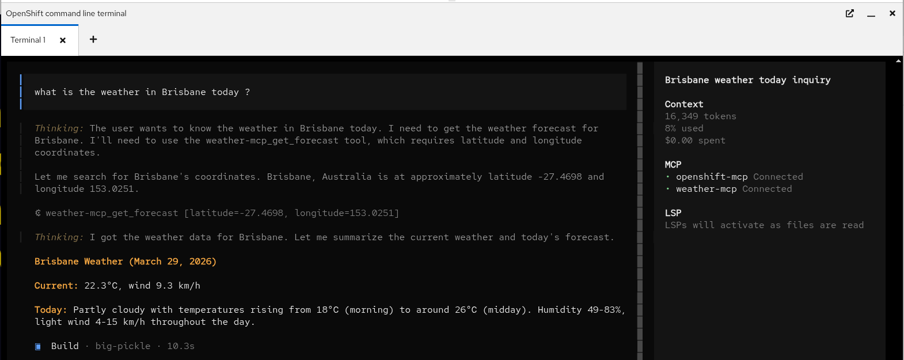

# Quickstart: Use MCP to check the weather

<span class="badge">Duration: 5 minutes</span>
<span class="badge">Topics: Getting started, Agents, CLI, MCP</span>

---

## Introduction

### Experience: Install  OpenCode and use MCP to check the weather

#### What's running

- **OpenCode** - an AI-powered CLI that connects to LLMs hosted on your OpenShift cluster
- **MCP servers** - lightweight services exposing tools (weather, OpenShift) to the LLM via the Model Context Protocol

#### What will be accomplished

- Install and configure OpenCode in your terminal
- Connect to remote MCP servers running on OpenShift
- Query real-time weather data through the LLM

#### Why this matters

- MCP gives LLMs access to live data and external tools without custom code
- Everything runs inside your cluster - no external API keys required
- The same pattern extends to any MCP-compatible tool (databases, APIs, cluster management)

## Prerequisites

> **None** - all the tools are available to you.

---

## Tasks

We will use the built in CLI to install OpenCode.

Follow these steps to access and start chatting with the LLM:

1. Click on the code to install OpenCode in your terminal.

    ```bash
    npm i opencode-ai@latest
    ```

1. Add OpenCode to out path.

    ```bash
    export PATH=/home/user/node_modules/.bin:$PATH
    ```

1. Configure the MCP servers in out environment for OpenCode

    Set up the environment.

    ```bash
    echo "User is: $DEVWORKSPACE_NAMESPACE"
    GUID=${DEVWORKSPACE_NAMESPACE#user-}
    MCP_WEATHER_SVC=mcp-weather-$GUID.mcp-weather-user-$GUID.svc.cluster.local
    OCP_MCP_SVC=mcp-openshift-$GUID-kubernetes-mcp-server.mcp-openshift-user-$GUID.svc.cluster.local
    mkdir -p $HOME/.config/opencode
    ```

    Create the configuration file.

    ```bash
    cat <<EOF > ~/.config/opencode/opencode.json
    {
    "\$schema": "https://opencode.ai/config.json",
    "mcp": {
        "weather-mcp": {
        "type": "remote",
        "url": "http://$MCP_WEATHER_SVC/mcp",
        "enabled": true
        },
        "openshift-mcp": {
        "type": "remote",
        "url": "http://$OCP_MCP_SVC:8080/mcp",
        "enabled": true
        }
    }
    }
    EOF
    ```

1. Start OpenCode.

    ```bash
    opencode
    ```

1. Ensure MCP Servers are connected - enter `/mcps` in OpenCode

    

1. Usee the weather mcp by prompting

    ```bash
    what is the weather in Brisbane today ?
    ```

    Of course use your location !

    

---

### Verification

<div class="alert alert-info">
  <strong>Check Your Progress</strong>
  <p><strong>Question:</strong> Did you get OpenCode working OK with the weather MCP?</p>
  <ul>
    <li><strong>Success:</strong> You have completed this task and can interact with the LLM.</li>
    <li><strong>Failed:</strong> This task isn't verified yet. Try the task again.</li>
  </ul>
</div>

---

## Conclusion

**Congratulations!** You successfully completed the **Use MCP to Check the weather** quickstart.

You've learned how to:

- Access OpenCode using the CLI interface with OpenShift
- Interact with a weather MCP server to check your local weather.

### Let's keep going!

**Next Quickstart:** Zero RAG: Talk to Your Data

---

## Additional Resources

- [Red Hat OpenShift AI Documentation](https://access.redhat.com/documentation/en-us/red_hat_openshift_ai_self-managed)
- [Red Hat AI Hugging Face Repository](https://red.ht/rhai-hf)

---

*Part of the Zero OpenShift AI Quickstart series*
